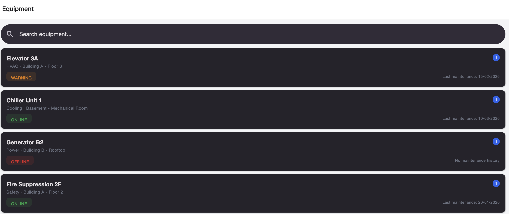
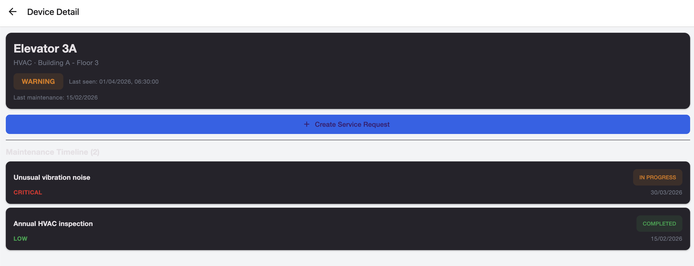
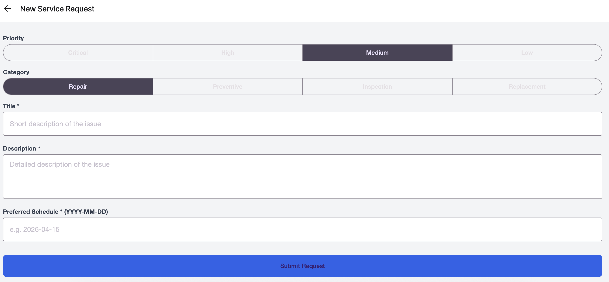
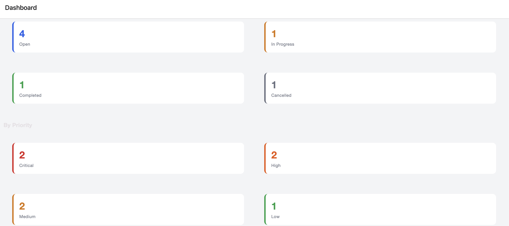

# ReliOps

A React Native app for IoT equipment operators to manage maintenance scheduling and service requests. Built with Expo, TypeScript, and Redux Toolkit.

---

## Screenshots

| Equipment List | Device Detail | Create Request | Dashboard |
|:---:|:---:|:---:|:---:|
|  |  |  |  |

---

## What it does

**Equipment List** — Browse all monitored devices with live search. Each card shows a color-coded status badge (ONLINE / WARNING / OFFLINE), how many open service requests are attached to that device, and when it was last serviced.

**Device Detail** — Tap any device to see its full info and a maintenance timeline sorted newest-first. From here you can open any existing request or create a new one.

**Create Service Request** — Pick a priority (Critical → Low), a category (Repair / Preventive / Inspection / Replacement), write a title and description, and set a preferred schedule date. All fields validate inline before submission.

**Service Request Detail** — Full view of a request with a status update button (`Open → In Progress → Completed / Cancelled`), a note input, and a reverse-chronological activity log of every status change and note ever added.

**Dashboard** — At-a-glance counts broken down by status and by priority, plus a list of any active requests whose scheduled date has already passed.

---

## Getting started

You need Node 18+ and the [Expo Go](https://expo.dev/go) app on your phone.

```bash
npm install
npx expo start
```

Scan the QR code in your terminal with your phone camera (iOS) or the Expo Go app (Android). The app will load immediately — no build step needed.

---

## Project structure

```
app/
  (tabs)/
    index.tsx           # Equipment List
    dashboard.tsx       # Dashboard
  device/
    [id].tsx            # Device Detail
  service-request/
    create.tsx          # Create Service Request form
    [id].tsx            # Service Request Detail + activity log
  _layout.tsx           # Root layout — Redux store + Paper theme providers

store/
  index.ts              # Store config
  slices/
    devicesSlice.ts          # Device list, search query, fetch thunk
    serviceRequestsSlice.ts  # Requests, create/update/note actions
  selectors/
    deviceSelectors.ts            # Filtered list, badge counts per device
    serviceRequestSelectors.ts    # Counts by status/priority, overdue, by-id

types/
  index.ts              # All enums and interfaces

data/
  mockData.ts           # 5 seed devices, 7 seed service requests

hooks/
  index.ts              # Typed useAppDispatch / useAppSelector
```

---

## State design

Two Redux slices — `devices` and `serviceRequests` — each managing their own loading and error states.

All service requests live in a **flat array**. I didn't nest them under device IDs because cross-device queries (dashboard counts, overdue list) are simpler when you can just filter the whole array. The `deviceId` field is the link — selectors do the join at read time.

All derived data is computed by **memoized selectors** (`createSelector`):

| Selector | Used by |
|---|---|
| `selectFilteredDevices` | Equipment list search |
| `selectOpenRequestCountByDevice` | Badge on each device card |
| `selectRequestsByDevice(id)` | Device detail timeline |
| `selectCountsByStatus` / `selectCountsByPriority` | Dashboard stat cards |
| `selectOverdueRequests` | Dashboard overdue section |
| `selectRequestById(id)` | Request detail screen |

Both fetch thunks use `createAsyncThunk` with a simulated delay (600ms for fetches, 400ms for creates) so loading states are real rather than instant flashes.

---

## Tech stack

| | |
|---|---|
| React Native + Expo | Cross-platform runtime |
| Expo Router | File-based navigation — tabs + nested stacks |
| TypeScript | End-to-end type safety |
| Redux Toolkit | State management — thunks, immer, createSelector |
| React Native Paper | Material Design 3 components |

---

## Trade-offs & what I'd add next

**Date field is a plain text input** — I'd normally use a native date picker but wanted to keep everything running in Expo Go without a native build. Validated with a regex against `YYYY-MM-DD`.

**No persistence** — State resets on reload. A real version would add `redux-persist` with AsyncStorage, which slots in cleanly on top of the existing store.

**Flat array vs. entity adapter** — Fine at this scale. At production scale I'd switch to RTK's `createEntityAdapter` for O(1) lookups by ID.

**Animated status transitions** — The timeline would feel better with a subtle animation when a request status changes.

**Tests** — The selectors and reducers are pure functions and straightforward to unit test with `@reduxjs/toolkit`'s `configureStore`. Didn't get to it in the time available.
